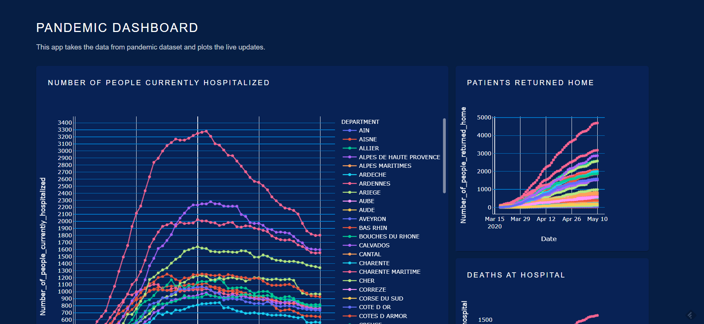

### COVID PANDEMIC DASHBOARD
Heroku Link: https://pandemic123.herokuapp.com/

1. To run the application clone this github and run app.py in terminal. The web app can be opened at the local host link.
2. The application uses the Plolty Dash application. There are 3 plots empbedded in the web app as shown below.

